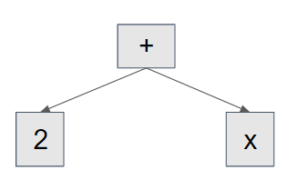
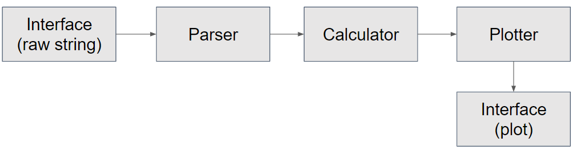

# CS 242 Final Project Proposal - Function Plotter

This is a function plotter built in Python. The functionality should be similar to this [web](https://www.desmos.com/calculator) except we are building this by Python locally instead of using Javascripts.

## Authors

Qikai Yang

Binghui Cheng

## Description

### Motivation

Plotting functions is essentical in mathematical analysis. There have been many awesome softwares that helps us make beautiful graphs of functions such as [this](https://www.desmos.com/calculator) and [this](http://fooplot.com/#W3sidHlwZSI6MCwiZXEiOiJ4XjIiLCJjb2xvciI6IiMwMDAwMDAifSx7InR5cGUiOjEwMDB9XQ--). Therefore, we would like to build a function plotter in Python locally on our own for easier mathematical analysis in the future.

### High-level functionalities

The input of our function plotter would be a string representing a function in the traditional way such as 2\*x + 2.

The output can be 1. the plot of the function 2. the plot of the function's dreviation.

To maintain the 4-week workload properly, we make several requirements on our input format. Our function only supports operators from `+-*/^()`, Unary operations including `ln()`, `sin()`, `cos()`, and `tan()`and mathematical constants including`pi`and`e`. Besides, our function plotter will support abbreviation of mathematical formulas such as `2(1+x)`or`2x+3`.

The output of our function plotter would be a figure drawing the curve of the function corresponding to the input raw string based on some user opintions.

### Modules and Flowchart

There will be 4 main modules in our function plotter.

1. **Parser (Qikai)**

This module aims to parse a raw string representing a function into a grammar tree. The grammar tree has several kinds of nodes. There are 2 main kinds. The first kind is the leaf node representing mathmatical constants and variables (such as `2` and `x`). The second kind is the internal node representing operators and constructors such as `+-*/()`. Here we are going to apply polymorphism to the nodes in our grammar tree to make the program extendable and maintainable. A sample graph is shown as below how our grammar tree looks like for the expression `2+x`.

2. **Calculator (Qikai)**

This module aims calculate an array of 2D points based on the grammar tree described above and the interval that user specifies. For example, if the user gives a function called `2+x^2` and an interval as `[-100, 100]`, our Calculator module would calculate an array of 2D points on `2+x^2` whose `x` values will be within the interval `[-100, 100]`.

3. **Plotter (Binghui)**

This module aims to plot an array of 2D points onto a draw board which are calculated by our Calculator. The plotter will serve as an intermediate stage between Calculator and Interface, the input to the plotter function will be a long array of 2D points that are the actual results computed from parser and calculator functions, then the output will be a long array of 2D points that each point in the array represent a point to connect on the actual output plot. There will be three main functionalities that need to be finished for this module. Bescause the index on the actual draw board is different from our acatual points' indexes, we have to resize and transform the indexes of 2D points onto the indexes on draw board. So the first two functionalities to be finishde would be `translation transformation` and `scale transformation`. Besdies, the axis of `x` and `y` will also need to be defined, so the third functionality is `axis set up`.

4. **Interface (Binghui)**

This module consists of 2 parts. The first part is for users to input their functions (i.e. raw strings), then the function will be the input to the parser function and after all the calculation, the second part of interface will read from the output of plotter functions and generate a plot based on those points.

5. **A Flowchart of Our Modules**
   

### Technologies, Tools and Style guides to follow

The technologies we use include building `parser` (without external parsing library), `grammar tree`, and `digital figure processing` (with the help of [OpenCV](https://opencv.org/)).

The external tools we are going to use include [OpenCV](https://opencv.org/). No other external libraries out of Python standard libries will be used.

The style guide we are going to follow is [PEP8 Standard](https://www.python.org/dev/peps/pep-0008/).

### Terminal Interface & GUI

We plan to use a combination of terminal interface and GUI. For terminal interface, the user will input the raw string of the function and some other user input options indicating the interval. For GUI, it will show the plot.
